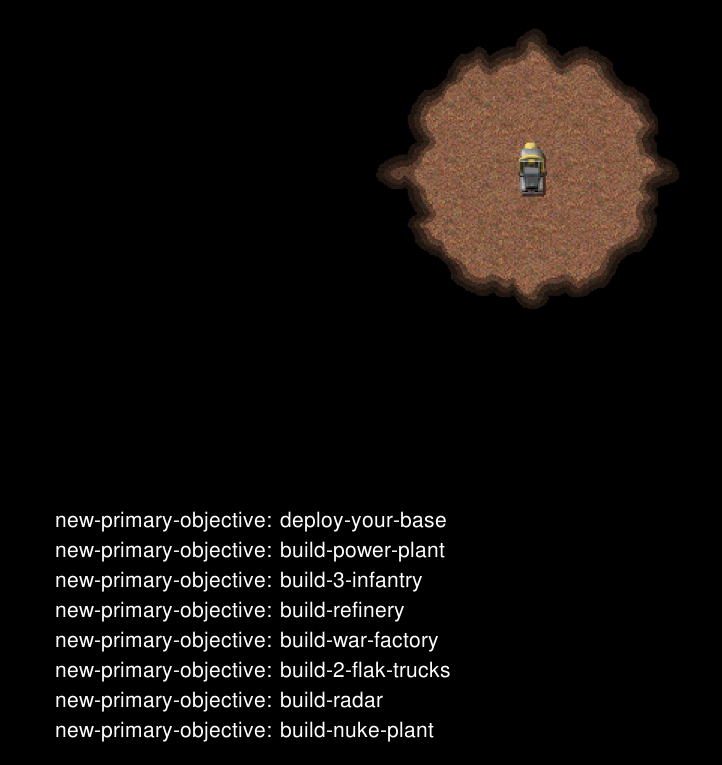

# 任务-01 基础建造

本任务提供了任务目标显示（图片左下角的内容），也可通过`ESC`来查看任务的完成情况

## 背景说明

地图为小型地图，提供一个基地车（MCV）

## 任务目标

在 **90** 秒内完成以下任务
- 部署基地车
- 建造 **1个** 电厂
- 建造 **1个** 矿场
- 生产 **3个** 步兵
- 建造 **1个** 战车工厂
- 生产 **2个** 移动防空车
- 建造 **1个** 雷达站
- 建造 **1个** 核电厂

## 补充内容

涉及API：place_building , start_production，production_actors等

考验AI对角色与建筑之间依赖关系的理解能力与执行命令的效率与准确性

## 评分标准

待定

---

# Mission-01 Basic Building

This mission provides task objective display (content in the lower left corner of the image), and you can also check the task completion status by pressing `ESC`.

## Background

The map is a small-sized map, providing one Mobile Construction Vehicle (MCV).

## Mission Objectives

Complete the following tasks within **90** seconds:
- Deploy the MCV
- Build **1** Power Plant
- Build **1** Refinery
- Produce **3** Infantry units
- Build **1** War Factory
- Produce **2** Flak Track units
- Build **1** Radar Dome
- Build **1** Advanced Power Plant

## Additional Information

Related APIs: place_building, start_production, production_actors, etc.

This tests the AI's understanding of dependencies between units and buildings, as well as the efficiency and accuracy of command execution.

## Scoring Criteria

coming soon