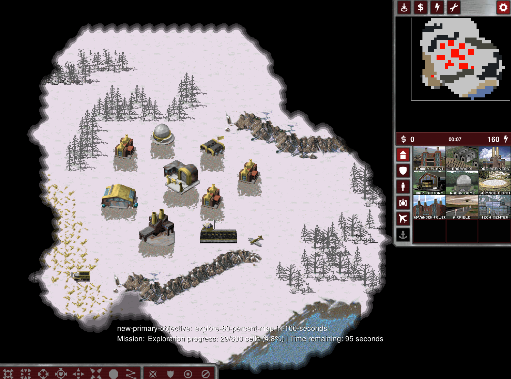

# 任务-02 战争迷雾

本任务提供了任务目标显示（图片左下角的内容），也可通过`ESC`来查看任务的完成情况

**部分特定的**任务目标失败时会**提前结束本局游戏**

## 背景说明

地图为小型地图，提供一架雅克战机

## 任务目标

在 **100** 秒内完成以下任务
- 使用雅克战机消除 **>=80%** 的战争迷雾

## 补充内容

涉及API：query_path, camera_move, fog_query等

评估AI对信息的处理、规划能力和决策速度

## 评分标准

待定

---

# Mission-02 Fog of War

This mission provides task objective display (content in the lower left corner of the image), and you can also check the task completion status by pressing `ESC`.

**Some specific** task objective failures will **end the current game early**.

## Background

The map is a small-sized map, providing one Yak.

## Mission Objectives

Complete the following tasks within **100** seconds:
- Use the Yak to eliminate **>=80%** of the Fog of War

## Additional Information

Related APIs: query_path, camera_move, fog_query, etc.

Evaluates the AI's information processing, planning capabilities, and decision-making speed.

## Scoring Criteria

coming soon