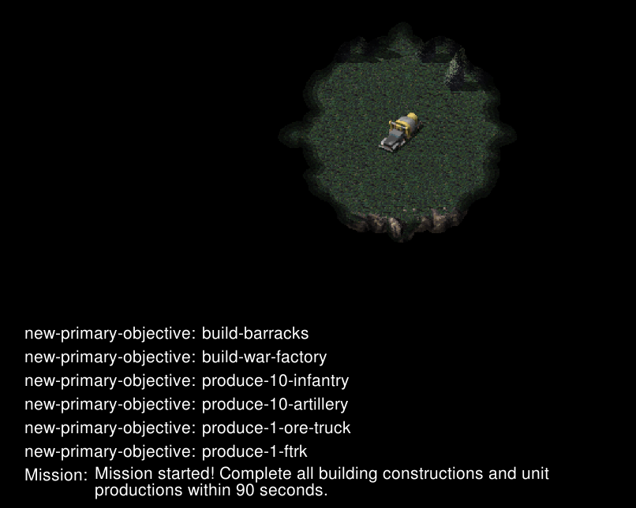

# 任务-03 高级建造

本任务提供了任务目标显示（图片左下角的内容），也可通过`ESC`来查看任务的完成情况

## 背景说明

地图为小型地图，提供一个基地车（MCV）

## 任务目标

在 **120** 秒内完成以下任务
- 建造 **1个** 电厂
- 建造 **1个** 战车工厂
- 生产 **10个** 步兵
- 生产 **10个** 炮兵
- 生产 **1个** 矿车
- 生产 **1个** 移动防空车

## 补充内容

涉及API：place_building , start_production，production_actors等

提示：可能需要注意建筑的摆放位置

## 评分标准

待定

---

# Mission-03 Advanced Building

This mission provides task objective display (content in the lower left corner of the image), and you can also check the task completion status by pressing `ESC`.

## Background

The map is a small-sized map, providing one Mobile Construction Vehicle (MCV).

## Mission Objectives

Complete the following tasks within **120** seconds:
- Build **1** Power Plant
- Build **1** War Factory
- Produce **10** Infantry
- Produce **10** Artillery
- Produce **1** Ore Truck
- Produce **1** Mobile Flak

## Additional Information

Related APIs: place_building, start_production, production_actors, etc.

Hint: You may need to pay attention to the placement position of buildings.

## Scoring Criteria

coming soon