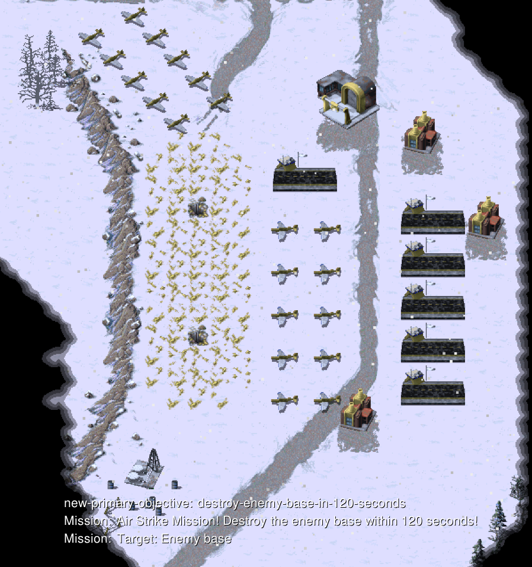

# 任务-04 空中打击

本任务提供了任务目标显示（图片下方的内容），也可通过`ESC`来查看任务的完成情况

**部分特定的**任务目标失败时会**提前结束本局游戏**

## 背景说明

地图为中型地图，提供 20 架雅克战机

## 任务目标

在 **120** 秒内完成以下任务
- 摧毁敌方基地

## 补充内容

涉及API：attack、query_path、select_unit等

考察AI在复杂环境下的战术部署和目标选择能力，尤其是如何平衡攻击效率与自我保护之间的关系

## 评分标准

待定

---

# Mission-04 Air Strike

This mission provides task objective display (content in the lower left corner of the image), and you can also check the task completion status by pressing `ESC`.

**Some specific** task objective failures will **end the current game early**.

## Background

The map is a medium-sized map, providing 20 Yak.

## Mission Objectives

Complete the following tasks within **120** seconds:
- Destroy the enemy base

## Additional Information

Related APIs: attack, query_path, select_unit, etc.

Examines the AI's tactical deployment and target selection capabilities in complex environments, especially how to balance attack efficiency with self-protection.

## Scoring Criteria

coming soon