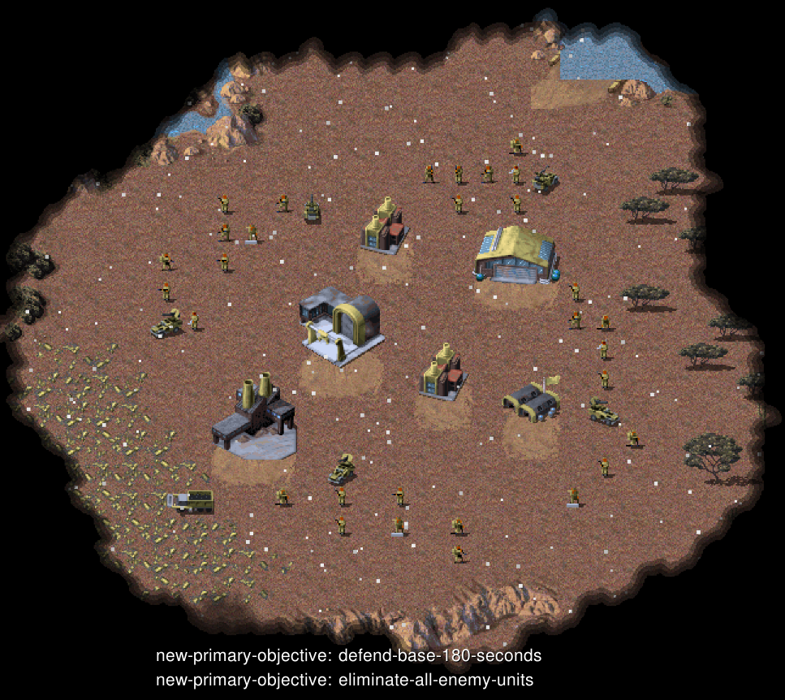

# 任务-05 基本防御

本任务提供了任务目标显示（图片左下角的内容），也可通过`ESC`来查看任务的完成情况

## 背景说明

地图为小型地图，初始提供30名步兵和5辆防空车和部分基础设施

敌人共包含60名步兵和10辆防空车，无增援

## 任务目标

在 **180** 秒内完成以下任务
- 保护基地不被摧毁
- 消灭所有敌人

## 补充内容

涉及API：produce, move_units_by_location, attack_target等

评估参赛者如何通过自然语言命令或多个命令来实现指挥兵种作战。

## 评分标准

待定

---

# Mission-05 Basic Defense

This mission provides task objective display (content in the lower left corner of the image), and you can also check the task completion status by pressing `ESC`.

## Background

The map is a small-sized map, initially providing 30 Infantry units, 5 Mobile Flak, and some basic infrastructure.

The enemy consists of 60 Infantry units and 10 Mobile Flak, with no reinforcements.

## Mission Objectives

Complete the following tasks within **180** seconds:
- Protect the base from being destroyed
- Eliminate all enemies

## Additional Information

Related APIs: produce, move_units_by_location, attack_target, etc.

Evaluates how participants use natural language commands or multiple commands to command unit combat operations.

## Scoring Criteria

coming soon